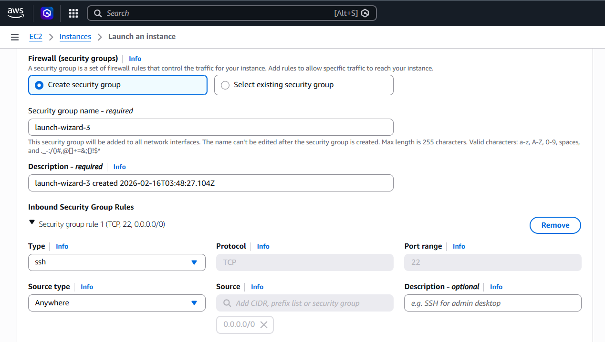
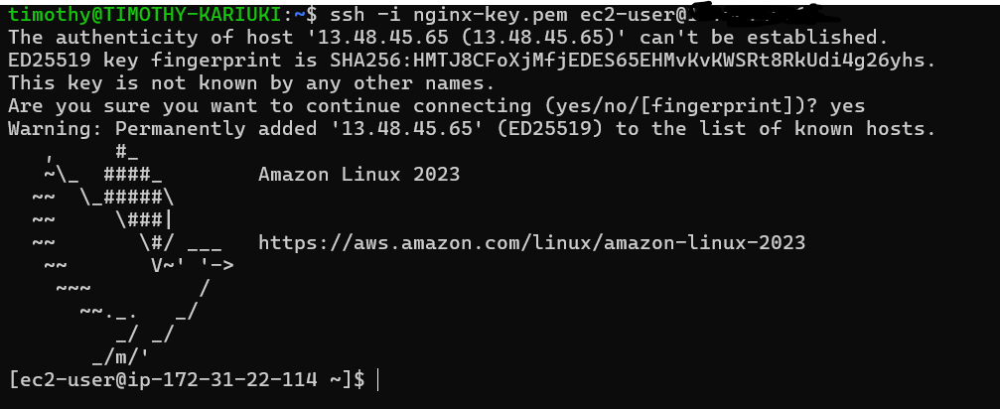
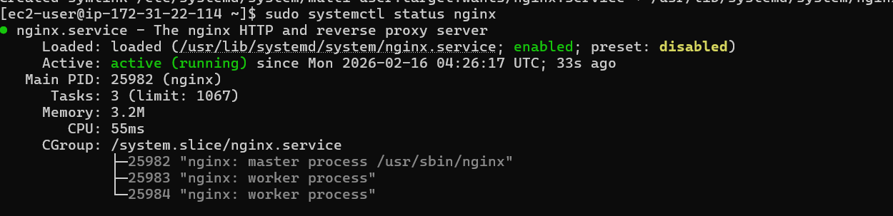

# AWS EC2 + Nginx Deployment Lab

## Objective
Deploy a live Nginx web server on AWS EC2.

## Steps Performed
#### 1. Launched EC2 instance (Amazon Linux 2023)

#### 2. Configured security group (SSH + HTTP)

#### 3. Connected via SSH

#### 4. Installed and started Nginx

#### 5. Accessed server via browser


## Commands Used

### SSH
```ssh -i nginx-key.pem ec2-user@PUBLIC_IP```

### Install Nginx
```
sudo dnf update -y
sudo dnf install nginx -y
sudo systemctl start nginx
sudo systemctl enable nginx
```

## Outcome
Successfully deployed a live web server accessible over the internet.
